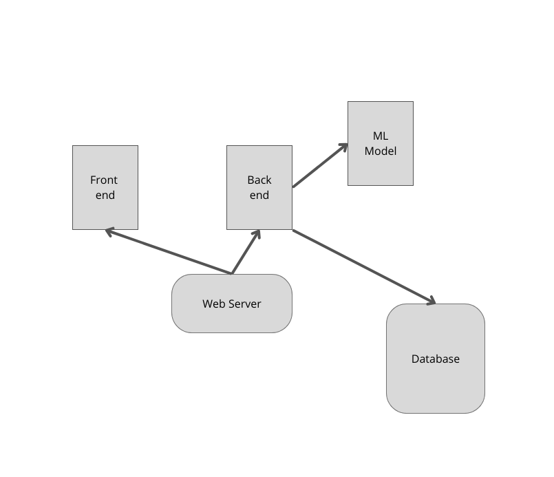
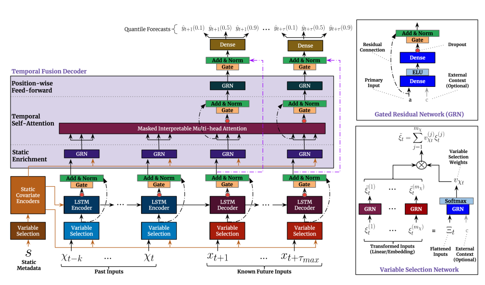
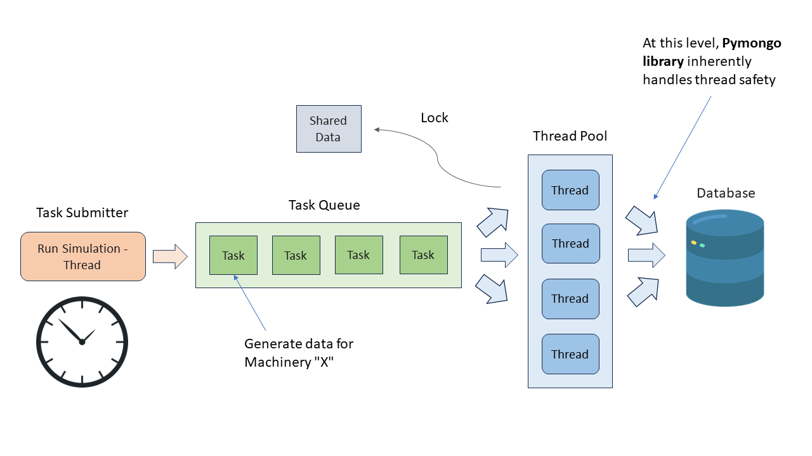
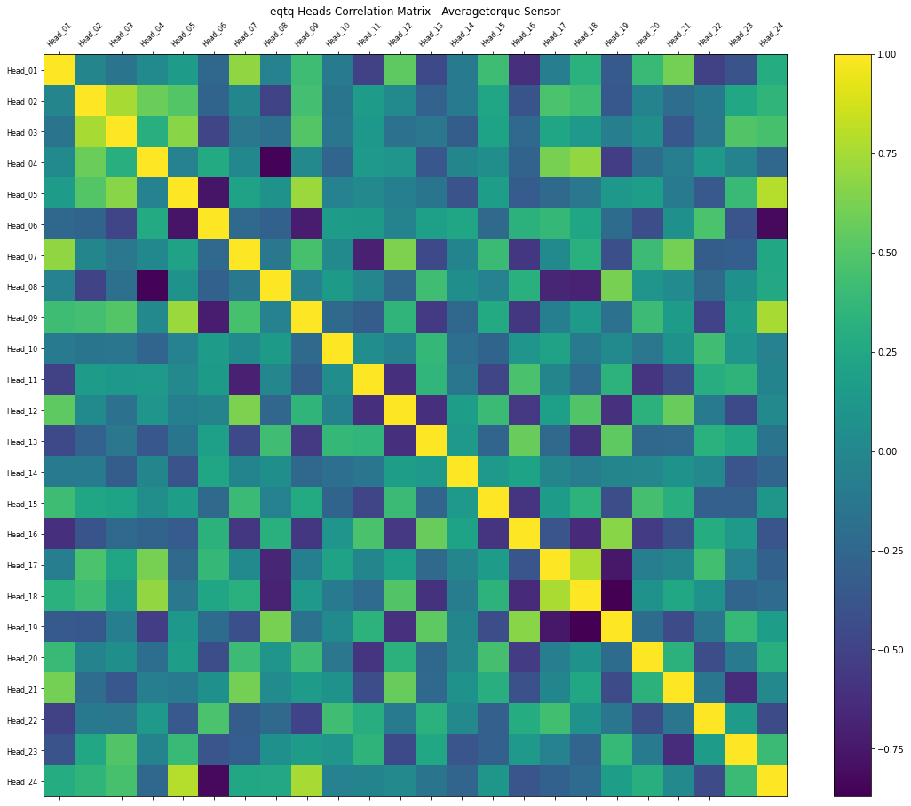

# Synthetic Sensor Data Generation for AROL Capping Devices

A Flask + React + MongoDB module that trains a Temporal Fusion
Transformer per (machinery, sensor, head) on real capping-line data and
serves synthetic sensor samples (and on-demand faults) through a REST
API. Built as the data-generation extension to Mario Deda's AROL Cloud
project. The main contribution sits in `./server`: the preprocessing
pipeline for unclean industrial sensor streams, the multi-process TFT
trainer, the sliding-window generator, and the rule-based fault
synthesiser.

<p align="center"></p>
<p align="center"><em>System architecture: React client, Flask server, MongoDB, and the TFT training and simulation paths.</em></p>

<p align="center"></p>
<p align="center"><em>Client UI: pick machinery, category, sensors and fault parameters.</em></p>

## Table of Contents

1. [Run locally](#run-locally)
2. [Run with Docker](#run-with-docker)
3. [API documentation](#api-documentation)
4. [Disclaimers and Attribution](#disclaimers-and-attribution)

## Run locally

MongoDB must be installed and listening on the configured host and port:

```env
MONGODB_HOST=localhost
MONGODB_PORT=27017
```

### Server

```bash
cd ./server
pip install -r requirements.txt
python server.py
```

### Client

```bash
cd ./client
npm install --force
npm run start
```

## Run with Docker

```bash
cd ./Docker
docker compose up --build
```

Then open Docker Desktop and confirm the containers under
`arol-cloud_data_generation` are running. The web client is served on
http://localhost:3000.

## API Documentation

Base URLs:

* <a href="http://localhost:5000">http://localhost:5000</a>

## post__generate_configuration

`POST /generate/configuration`

*Insert a configuration*

Insert a new configuration

> Body parameter

```json
{
  "name": "string",
  "machineriesSelected": [
    {
      "uid": "string",
      "modelName": "string",
      "faultFrequency": 0,
      "faultProbability": 0,
      "sensorsSelected": [
        {
          "name": "string",
          "category": "string", 
          "heads": [0],
          "dataFrequency": 0
        }
      ]
    }
  ]
}
```

<h3 id="post__generate_configuration-parameters">Parameters</h3>

| Name                  | In   | Type                                         | Required | Description        |
| --------------------- | ---- | -------------------------------------------- | -------- | ------------------ |
| body                  | body | [Configuration](#schemaConfiguration)        | true     | Configuration data |
| » name                | body | string                                       | true     | none               |
| » machineriesSelected | body | [MachinerySelected](schemaMachinerySelected) | true     | none               |
| »» uid                | body | string                                       | true     | none               |
| »» modelName          | body | string                                       | true     | none               |
| »» faultFrequency     | body | number                                       | true     | none               |
| »» faultProbability   | body | number                                       | true     | none               |
| »» sensorsSelected    | body | [SensorSelected](schemaSensorSelected)       | true     | none               |
| »»» name              | body | string                                       | true     | none               |
| »»» category          | body | string                                       | true     | none               |
| »»» heads             | body | [number]                                     | true     | none               |
| »»» dataFrequency     | body | number                                       | true     | none               |


<h3 id="post__generate_configuration-responses">Responses</h3>

| Status | Meaning                                                                    | Description                                  | Schema                                                |
| ------ | -------------------------------------------------------------------------- | -------------------------------------------- | ----------------------------------------------------- |
| 200    | [OK](https://tools.ietf.org/html/rfc7231#section-6.3.1)                    | Configuration inserted                       | [ConfigurationResponse](#schemaConfigurationResponse) |
| 400    | [Bad Request](https://tools.ietf.org/html/rfc7235#section-6.5.1)           | Invalid configuration detected               | None                                                  |
| 500    | [Internal Server Error](https://tools.ietf.org/html/rfc7235#section-6.6.1) | Server encountered an unexpected contidition | None                                                  |

> Example responses

> 200 Response

```json
{
  "message": "Configuration saved",
  "configuration": {
    "_id": 0,
    "name": "string",
    "machineriesSelected": [
      {
        "uid": "string",
        "modelName": "string",
        "faultFrequency": 0,
        "faultProbability": 0,
        "sensorsSelected": [
          {
            "name": "string",
            "category": "string", 
            "heads": [0],
            "dataFrequency": 0
          }
        ]
      }
    ]
  }
}
```

> 400 Response

```json
{ 
  "error": "The field name is required and must be of type str"
}
```

> 500 Response

```json
{ 
  "error": "Internal server error"
}
```

## put__generate_configuration_{name}

`PUT /generate/configuration/{name}`

*Update a configuration*

Update a saved configuration whose name is given

> Body parameter

```json
{
  "machineriesSelected": [
    {
      "uid": "string",
      "modelName": "string",
      "faultFrequency": 0,
      "faultProbability": 0,
      "sensorsSelected": [
        {
          "name": "string",
          "category": "string", 
          "heads": [0],
          "dataFrequency": 0
        }
      ]
    }
  ]
}
```

<h3 id="put__generate_configuration_{name}-parameters">Parameters</h3>

| Name                  | In   | Type                                                            | Required | Description        |
| --------------------- | ---- | --------------------------------------------------------------- | -------- | ------------------ |
| name                  | path | string                                                          | true     | Configuration name |
| body                  | body | [MachinerySelectedResponse](#schemaMachineriesSelectedResponse) | true     | none               |
| » machineriesSelected | body | [MachinerySelected](schemaMachinerySelected)                    | true     | none               |
| »» uid                | body | string                                                          | true     | none               |
| »» modelName          | body | string                                                          | true     | none               |
| »» faultFrequency     | body | number                                                          | true     | none               |
| »» faultProbability   | body | number                                                          | true     | none               |
| »» sensorsSelected    | body | [SensorSelected](schemaSensorSelected)                          | true     | none               |
| »»» name              | body | string                                                          | true     | none               |
| »»» category          | body | string                                                          | true     | none               |
| »»» heads             | body | [number]                                                        | true     | none               |
| »»» dataFrequency     | body | number                                                          | true     | none               |


<h3 id="put__generate_configuration_{name}-responses">Responses</h3>

| Status | Meaning                                                                    | Description                                  | Schema                                                |
| ------ | -------------------------------------------------------------------------- | -------------------------------------------- | ----------------------------------------------------- |
| 200    | [OK](https://tools.ietf.org/html/rfc7231#section-6.3.1)                    | Configuration updated                        | [ConfigurationResponse](#schemaConfigurationResponse) |
| 204    | [No Content](https://tools.ietf.org/html/rfc7231#section-6.3.5)            | Nothing to update                            | None                                                  |
| 400    | [Bad Request](https://tools.ietf.org/html/rfc7235#section-6.5.1)           | Invalid configuration detected               | None                                                  |
| 404    | [Not Found](https://tools.ietf.org/html/rfc7231#section-6.5.4)             | Configuration with the given name not found  | None                                                  |
| 500    | [Internal Server Error](https://tools.ietf.org/html/rfc7235#section-6.6.1) | Server encountered an unexpected contidition | None                                                  |

> Example responses

> 200 Response

```json
{
  "message": "Update saved",
  "configuration": {
    "_id": 0,
    "name": "string",
    "machineriesSelected": [
      {
        "uid": "string",
        "modelName": "string",
        "faultFrequency": 0,
        "faultProbability": 0,
        "sensorsSelected": [
          {
            "name": "string",
            "category": "string", 
            "heads": [0],
            "dataFrequency": 0
          }
        ]
      }
    ]
  }
}
```
> 204 Response

```json
{ 
  "message": "No changes to save"
}
```

> 400 Response

```json
{ 
  "error": "At least one machinery is required"
}
```

> 404 Response

```json
{ 
  "error": "Configuration not found"
}
```

> 500 Response

```json
{ 
  "error": "Internal server error"
}
```

## get__generate_configurations_{name}

`GET /generate/configurations/{name}`

*Configuration by its name*

Get a saved configuration by its name

<h3 id="get__generate_configurations_{name}-parameters">Parameters</h3>

| Name | In   | Type   | Required | Description                           |
| ---- | ---- | ------ | -------- | ------------------------------------- |
| name | path | string | true     | The name of the desired configuration |


<h3 id="get__generate_configurations_{name}-responses">Responses</h3>

| Status | Meaning                                                                    | Description                                  | Schema                                                |
| ------ | -------------------------------------------------------------------------- | -------------------------------------------- | ----------------------------------------------------- |
| 200    | [OK](https://tools.ietf.org/html/rfc7231#section-6.3.1)                    | Configuration information                    | [ConfigurationResponse](#schemaConfigurationResponse) |
| 400    | [Bad Request](https://tools.ietf.org/html/rfc7231#section-6.5.1)           | Invalid configuration name detected          | None                                                  |
| 404    | [Not Found](https://tools.ietf.org/html/rfc7231#section-6.5.4)             | Configuration with the given name not found  | None                                                  |
| 500    | [Internal Server Error](https://tools.ietf.org/html/rfc7235#section-6.6.1) | Server encountered an unexpected contidition | None                                                  |

> Example responses

> 200 Response

```json
{
  "message": "Configuration retrievd with success",
  "configuration": {
    "_id": 0,
    "name": "string",
    "machineriesSelected": [
      {
        "uid": "string",
        "modelName": "string",
        "faultFrequency": 0,
        "faultProbability": 0,
        "sensorsSelected": [
          {
            "name": "string",
            "category": "string", 
            "heads": [0],
            "dataFrequency": 0
          }
        ]
      }
    ]
  }
}
```
> 400 Response

```json
{ 
  "error": "The name parameter must be provided as a valid string"
}
```

> 404 Response

```json
{ 
  "error": "Configuration not found"
}
```

> 500 Response

```json
{ 
  "error": "Internal server error"
}
```

## get__generate_configuraion_names

`GET /generate/configuration/names`

*Configuration Names*

Get the names of the configurations saved

<h3 id="get__generate_ConfigurationsNames-responses">Responses</h3>

| Status | Meaning                                                                    | Description                                  | Schema                                            |
| ------ | -------------------------------------------------------------------------- | -------------------------------------------- | ------------------------------------------------- |
| 200    | [OK](https://tools.ietf.org/html/rfc7231#section-6.3.1)                    | Configuration names                          | [ConfigurationsNames](#schemaConfigurationsNames) |
| 500    | [Internal Server Error](https://tools.ietf.org/html/rfc7235#section-6.6.1) | Server encountered an unexpected contidition | None                                              |

> Example responses

> 200 Response

```json
{
  "configurationsNames":  [
    "string"
  ]
}
```

> 500 Response

```json
{ 
  "error": "Internal server error"
}
```

## delete__generate_configuration_{name}

`DELETE /generate/configuration/{name}`

*Delete configuration*

Delete a configuration by its name

<h3 id="delete__generate_configuration_{name}-parameters">Parameters</h3>

| Name | In   | Type   | Required | Description                           |
| ---- | ---- | ------ | -------- | ------------------------------------- |
| name | path | string | true     | The name of the desired configuration |


<h3 id="delete__generate_configuration_{name}-responses">Responses</h3>

| Status | Meaning                                                                    | Description                                  | Schema |
| ------ | -------------------------------------------------------------------------- | -------------------------------------------- | ------ |
| 200    | [OK](https://tools.ietf.org/html/rfc7231#section-6.3.1)                    | Configuration deleted successfully           | None   |
| 400    | [Bad Request](https://tools.ietf.org/html/rfc7231#section-6.5.1)           | Invalid configuration name detected          | None   |
| 404    | [Not Found](https://tools.ietf.org/html/rfc7231#section-6.5.4)             | Configuration with the given name not found  | None   |
| 500    | [Internal Server Error](https://tools.ietf.org/html/rfc7235#section-6.6.1) | Server encountered an unexpected contidition | None   |

> Example responses

> 200 Response

```json
{
  "message": "Configuration deleted"
}
```

> 400 Response

```json
{ 
  "error": "The name parameter must be provided as a valid string"
}
```

> 404 Response

```json
{ 
  "error": "Configuration not found"
}
```

> 500 Response

```json
{ 
  "error": "Internal server error"
}
```
## get__model_status

`GET /generate/model/status`

*Model status*

Check if there is a model aldready trained or not

<h3 id="put__generate_model_status-responses">Responses</h3>

| Status | Meaning                                                                    | Description                                  | Schema |
| ------ | -------------------------------------------------------------------------- | -------------------------------------------- | ------ |
| 200    | [OK](https://tools.ietf.org/html/rfc7231#section-6.3.1)                    | Status of the model obtained                 | None   |
| 500    | [Internal Server Error](https://tools.ietf.org/html/rfc7235#section-6.6.1) | Server encountered an unexpected contidition | None   |

> Example responses

> 200 Response

```json
{
  "message": "Model already trained",
  "trained": true
}
```

> 500 Response

```json
{ 
  "error": "Internal server error"
}
```

## put__model_train

`PUT /generate/model/train`

*Train model*

Train the model

<h3 id="put__generate_model_train-responses">Responses</h3>

| Status | Meaning                                                                    | Description                                  | Schema |
| ------ | -------------------------------------------------------------------------- | -------------------------------------------- | ------ |
| 200    | [OK](https://tools.ietf.org/html/rfc7231#section-6.3.1)                    | Model trained successfully                   | None   |
| 500    | [Internal Server Error](https://tools.ietf.org/html/rfc7235#section-6.6.1) | Server encountered an unexpected contidition | None   |

> Example responses

> 200 Response

```json
{
  "message": "Model trained"
}
```

> 500 Response

```json
{ 
  "error": "Internal server error"
}
```


## post_simulation_run

`POST /generate/simulation/run`

*Run Simulation*

Run a simulation and saved each generated data

> Body parameter

```json
{
  "machineriesSelected": [
    {
      "uid": "string",
      "modelName": "string",
      "faultFrequency": 0,
      "faultProbability": 0,
      "sensorsSelected": [
        {
          "name": "string",
          "category": "string", 
          "heads": [0],
          "dataFrequency": 0
        }
      ]
    }
  ]
}
```

<h3 id="post__generate_simualtion_run-parameters">Parameters</h3>

| Name                  | In   | Type                                                          | Required | Description               |
| --------------------- | ---- | ------------------------------------------------------------- | -------- | ------------------------- |
| body                  | body | [MachinerySelectedResponse](#schemaMachinerySelectedResponse) | true     | Machineries selected data |
| » machineriesSelected | body | list                                                          | true     | none                      |
| »» uid                | body | string                                                        | true     | none                      |
| »» modelName          | body | string                                                        | true     | none                      |
| »» faultFrequency     | body | number                                                        | true     | none                      |
| »» faultProbability   | body | number                                                        | true     | none                      |
| »» sensorsSelected    | body | list                                                          | true     | none                      |
| »»» name              | body | string                                                        | true     | none                      |
| »»» category          | body | string                                                        | true     | none                      |
| »»» heads             | body | [number]                                                      | true     | none                      |
| »»» dataFrequency     | body | number                                                        | true     | none                      |

<h3 id="post__generate_simualtion_run-responses">Responses</h3>

| Status | Meaning                                                                    | Description                                  | Schema                                    |
| ------ | -------------------------------------------------------------------------- | -------------------------------------------- | ----------------------------------------- |
| 200    | [OK](https://tools.ietf.org/html/rfc7231#section-6.3.1)                    | Simulation completed                         | [SimulationStats](#schemaSimulationStats) |
| 400    | [Bad Request](https://tools.ietf.org/html/rfc7235#section-6.5.1)           | Invalid configuration detected               | None                                      |
| 500    | [Internal Server Error](https://tools.ietf.org/html/rfc7235#section-6.6.1) | Server encountered an unexpected contidition | None                                      |


> Example responses

> 200 Response

```json
{
  "message": "The data have been generated",
  "samples_generated": 0,
  "faults_generated": 0,
  "simulation_time": 0
}
```

> 400 Response

```json
{ 
  "error": "At least one machinery is required"
}
```

> 404 Response

```json
{ 
  "error": "Configuration not found"
}
```

> 500 Response

```json
{ 
  "error": "Internal server error"
}
```

## put__simulation_stop

`PUT /generate/simulation/stop`

*Stop simulation*

Stop a running simulation

<h3 id="put__generate_simulation_stop-responses">Responses</h3>

| Status | Meaning                                                                    | Description                                  | Schema |
| ------ | -------------------------------------------------------------------------- | -------------------------------------------- | ------ |
| 200    | [OK](https://tools.ietf.org/html/rfc7231#section-6.3.1)                    | Simulation stopped successfully              | None   |
| 204    | [No Content](https://tools.ietf.org/html/rfc7231#section-6.3.5)            | No simulation to stop                        | None   |
| 500    | [Internal Server Error](https://tools.ietf.org/html/rfc7235#section-6.6.1) | Server encountered an unexpected contidition | None   |

> Example responses

> 200 Response

```json
{
  "message": "Simulation stopped"
}
```

> 204 Response

```json
{
  "message": "No action to interrumpt"
}
```

> 500 Response

```json
{ 
  "error": "Internal server error"
}
```


# Schemas

<h2 id="schemaConfiguration">Configuration</h2>
<a id="schemaConfiguration"></a>

```json
{
  "name": "string",
  "machineriesSelected": [
    {
      "uid": "string",
      "modelName": "string",
      "faultFrequency": 0,
      "faultProbability": 0,
      "sensorsSelected": [
        {
          "name": "string",
          "category": "string", 
          "heads": [0],
          "dataFrequency": 0
        }
      ]
    }
  ]
}
```

### Properties

| Name                | Type                | Required | Restrictions   | Description |
| ------------------- | ------------------- | -------- | -------------- | ----------- |
| name                | string              | true     | none           | none        |
| machineriesSelected | [MachinerySelected] | true     | none           | none        |
| » uid               | string              | true     | none           | none        |
| » modelName         | string              | true     | none           | none        |
| » faultFrequency    | number              | true     | none           | none        |
| » faultProbability  | number              | true     | >= 0 && <= 100 | none        |
| » sensorsSelected   | [SensorSelected]    | true     | none           | none        |
| »» name             | string              | true     | none           | none        |
| »» category         | string              | true     | none           | none        |
| »» heads            | [number]            | true     | none           | none        |
| »» dataFrequency    | number              | true     | none           | none        |

<h2 id="schemaMachinerySelected">MachinerySelected</h2>
<a id="schemaMachinerySelected"></a>

```json
{
  "uid": "string",
  "modelName": "string",
  "faultFrequency": 0,
  "faultProbability": 0,
  "sensorsSelected": [
    {
      "name": "string",
      "category": "string", 
      "heads": [0],
      "dataFrequency": 0
    }
  ]
}
```

### Properties

| Name             | Type             | Required | Restrictions   | Description |
| ---------------- | ---------------- | -------- | -------------- | ----------- |
| uid              | string           | true     | none           | none        |
| modelName        | string           | true     | none           | none        |
| faultFrequency   | number           | true     | none           | none        |
| faultProbability | number           | true     | >= 0 && <= 100 | none        |
| sensorsSelected  | [SensorSelected] | true     | none           | none        |
| » name           | string           | true     | none           | none        |
| » category       | string           | true     | none           | none        |
| » heads          | [number]         | true     | none           | none        |
| » dataFrequency  | number           | true     | none           | none        |

<h2 id="schemaSensorSelected">SensorSelected</h2>
<a id="schemaSensorSelected"></a>

```json
{
  "name": "string",
  "category": "string", 
  "heads": [0],
  "dataFrequency": 0
}

```

### Properties

| Name          | Type     | Required | Restrictions | Description |
| ------------- | -------- | -------- | ------------ | ----------- |
| name          | string   | true     | none         | none        |
| category      | string   | true     | none         | none        |
| heads         | [number] | true     | none         | none        |
| dataFrequency | number   | true     | none         | none        |


<h2 id="schemaMachinerySelectedResponse">MachinerySelectedResponse</h2>
<a id="schemaMachinerySelectedResponse"></a>

```json
{
  "machineriesSelected": [
    {
      "uid": "string",
      "modelName": "string",
      "faultFrequency": 0,
      "faultProbability": 0,
      "sensorsSelected": [
        {
          "name": "string",
          "category": "string", 
          "heads": [0],
          "dataFrequency": 0
        }
      ]
    }
  ]
}
```

### Properties

| Name                | Type                | Required | Restrictions   | Description |
| ------------------- | ------------------- | -------- | -------------- | ----------- |
| machineriesSelected | [MachinerySelected] | true     | none           | none        |
| uid                 | string              | true     | none           | none        |
| modelName           | string              | true     | none           | none        |
| faultFrequency      | number              | true     | none           | none        |
| faultProbability    | number              | true     | >= 0 && <= 100 | none        |
| sensorsSelected     | [SensorSelected]    | true     | none           | none        |
| » name              | string              | true     | none           | none        |
| » category          | string              | true     | none           | none        |
| » heads             | [number]            | true     | none           | none        |
| » dataFrequency     | number              | true     | none           | none        |


<h2 id="schemaConfigurationResponse">ConfigurationResponse</h2>
<a id="schemaConfigurationResponse"></a>

```json
{
  "message": "Configuration saved",
  "configuration": {
    "_id": 0,
    "name": "string",
    "machineriesSelected": [
      {
        "uid": "string",
        "modelName": "string",
        "faultFrequency": 0,
        "faultProbability": 0,
        "sensorsSelected": [
          {
            "name": "string",
            "category": "string", 
            "heads": [0],
            "dataFrequency": 0
          }
        ]
      }
    ]
  }
}
```

### Properties

| Name                  | Type                | Required | Restrictions   | Description |
| --------------------- | ------------------- | -------- | -------------- | ----------- |
| message               | string              | true     | none           | none        |
| Configuration         | object              | true     | none           | none        |
| » id                  | string              | true     | none           | none        |
| » name                | string              | true     | none           | none        |
| » machineriesSelected | [MachinerySelected] | true     | none           | none        |
| »» uid                | string              | true     | none           | none        |
| »» modelName          | string              | true     | none           | none        |
| »» faultFrequency     | number              | true     | none           | none        |
| »» faultProbability   | number              | true     | >= 0 && <= 100 | none        |
| »» sensorsSelected    | [SensorSelected]    | true     | none           | none        |
| »»» name              | string              | true     | none           | none        |
| »»» category          | string              | true     | none           | none        |
| »»» heads             | [number]            | true     | none           | none        |
| »»» dataFrequency     | number              | true     | none           | none        |

<h2 id="schemaConfigurationsNames">ConfigurationsNames</h2>
<a id="schemaConfigurationsNames"></a>

```json
{
  "configurationsNames":  [
    "string"
  ]
}
```

### Properties

| Name                | Type     | Required | Restrictions | Description |
| ------------------- | -------- | -------- | ------------ | ----------- |
| configurationsNames | [string] | true     | none         | none        |

<h2 id="schemaSimulationStats">SimulationStats</h2>
<a id="schemaSimulationStats"></a>

```json
{
  "message": "The data have been generated",
  "samples_generated": 0,
  "faults_generated": 0,
  "simulation_time": 0
}
```

### Properties

| Name              | Type   | Required | Restrictions | Description |
| ----------------- | ------ | -------- | ------------ | ----------- |
| message           | string | true     | none         | none        |
| samples_generated | number | true     | none         | none        |
| faults_generated  | number | true     | none         | none        |
| simulation_time   | number | true     | none         | none        |

## Disclaimers and Attribution

This repository combines third-party components with original work.

**Third-party components:**

- The web client, MongoDB schema, and the Flask scaffolding extend
  [Mario Deda's AROL Cloud](https://github.com/MarioDeda)
  project (SDP 2022-2023). The data-generation feature was added on
  top; the surrounding UI shell is reused as is.
- The forecasting model under the hood is the
  [Temporal Fusion Transformer](https://arxiv.org/abs/1912.09363)
  (Lim et al., 2019), used through the
  [`pytorch-forecasting`](https://github.com/jdb78/pytorch-forecasting)
  library. The model class, training loop primitives, and
  `TimeSeriesDataSet` API are upstream and used unchanged.

<p align="center"></p>
<p align="center"><em>Training and serving topology: multi-process TFT training per sensor in <code>train.py</code>, thread-pool real-time generator in <code>simulation.py</code>.</em></p>

<p align="center"></p>
<p align="center"><em>Example synthetic AverageTorque output across heads after a training sweep, illustrating preserved cross-head correlations.</em></p>

**Original contributions (this PR):**

- `server/modules/preprocessing.py`: `Extract` and `ExtractPlc` classes
  for ingesting unclean industrial sensor streams from MongoDB. Handles
  per-recording metadata, separates deterministic from
  non-deterministic sensors, fills NaNs without leaking future
  information, and reshapes EQTQ/DRIVE/PLC categories into a
  per-head feature frame.
- `server/modules/trainer.py`: a thin `Trainer` wrapper around the
  pytorch-forecasting TFT that builds the `TimeSeriesDataSet`,
  configures Lightning callbacks (early stopping, checkpoint,
  TensorBoard logging), runs per-sensor learning-rate finding, and
  exposes a clean `fit / predict / load_model` API.
- `server/modules/generators.py`: `Generate` and `GeneratePlc` classes
  that load a sensor's trained model, hold a rolling encoder buffer,
  and produce one or more future samples per call. The fault generator
  uses a configurable `mean + std * (std_param + uniform_noise)`
  pattern for non-deterministic sensors and a bias-percentage offset
  for deterministic ones.
- `server/modules/config.py`: `TrainArgs`, `InferArgs`, and the
  `EQTQ` / `DRIVE` / `PLC` dataset configs that pin down each
  category's sensor list and grouping schema.
- `server/train.py`: parallel multi-process training driver that
  sweeps every (machinery, category, sensor, head) combination with
  `torch.multiprocessing` and silences per-task TF / Lightning output.
- `server/simulation.py`: thread-pool real-time generator that decides
  per sensor whether to emit a normal sample or a fault, writes to
  MongoDB through `Thread_struct`, and logs each emission.
- `server/server.py`: Flask REST endpoints for configurations and
  simulation control.

**Why a custom preprocessing and fault-generation layer was needed.**
The raw capping-line data is noisy, irregularly sampled, and contains
deterministic sensors (constant set-points), low-variance sensors, and
genuine continuous channels mixed together. Off-the-shelf TFT inputs
assume well-conditioned, regularly sampled multivariate series; the
preprocessing layer reshapes the data into that form, while the
generator layer reintroduces realistic faults on the synthetic output
so the downstream system can be exercised with collision-like events.
